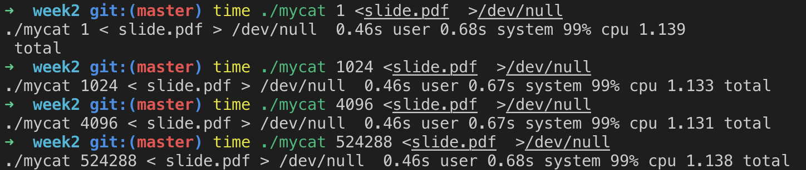

# 操作系统作业
教材：Unix环境高级编程笔记
### 作业连接

| **时间** | **题目** | **作业地址** | **总结** |
| :-: | :-: | :-: | :-: |
| 第二周 | 测试文件IO性能 | [作业](./homework/week2/mycat.c) | [过程](#第二周作业) |

-------

#### 第二周作业
作业内容为测试3.9节 I/O的效率， 根据用不同缓冲长度进行读操作的时间结果

[程序链接](./homework/week2/mycat.c)

##### 在命令行运行
``` sh
cc -o mycat mycat.c
time ./mycat 1 <slide.pdf  >/dev/null
time ./mycat 1024 <slide.pdf  >/dev/null
time ./mycat 4096 <slide.pdf  >/dev/null
```
##### 编写脚本运行
``` sh
chmod 777 running.sh
sh running.sh
```
##### 运行结果
